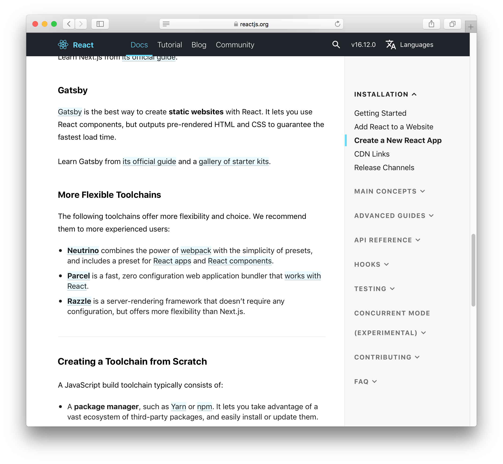

---

## 드디어 블로그 첫 글 !

바쁘다는 핑계로, 다른 할 일이 있다는 핑계로 블로그 만드는 것을 미루어 오다가, 일단 뭐라도 만들어보자 싶어 일단 **gatsby**를 이용해 블로그를 만들어보았습니다.

github pages는 jekyll을 기본적으로 지원하고 있고 이 외에도 다른 프레임워크가 많지만, 우선 gatsby를 사용하기로 한 가장 큰 계기는 React 때문이었습니다. 최근 React와 React-Native를 프로젝트에 사용하기 위해 공부를 시작했는데, [`create-react-app`](https://ko.reactjs.org/docs/create-a-new-react-app.html#gatsby) 에서 static 웹을 만드는데 가장 좋은 방법이라는 글을 보고 결정하게 되었습니다.

 _[react](https://reactjs.org/docs/create-a-new-react-app.html#gatsby)가 gatsby를 추천합니다👍_

사용한 템플릿은 gatsby가 기본적으로 가지고 있는 example-using-remark 를 사용하였습니다. 호스팅은 github.io를 통해 하고 있습니다.
