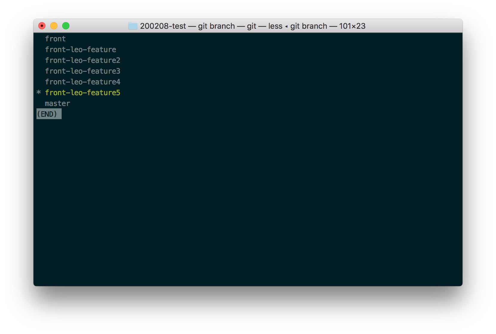
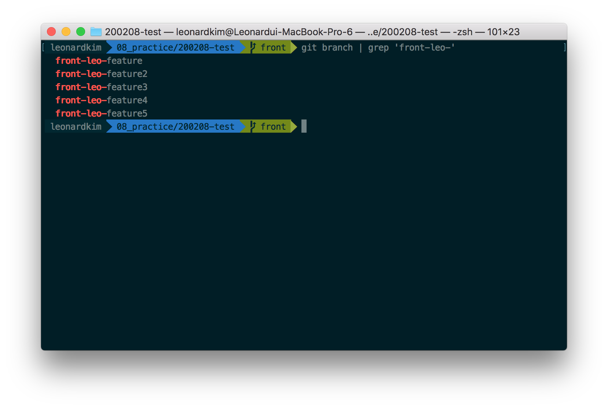
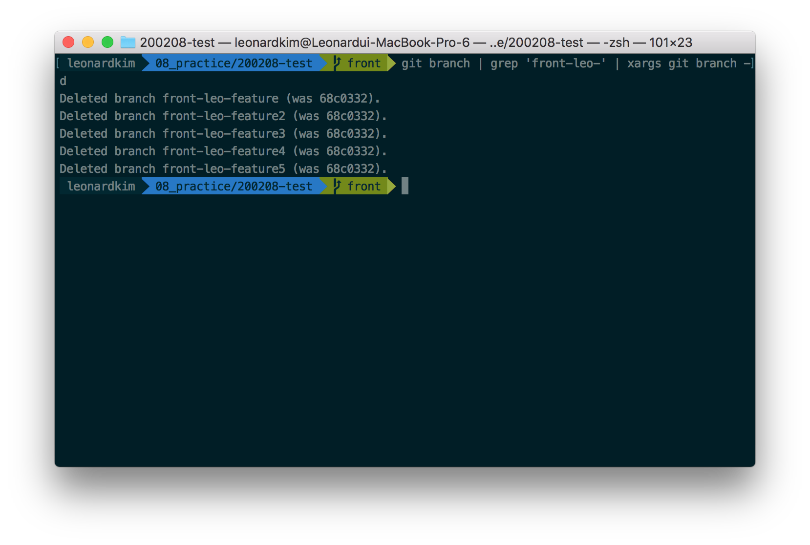
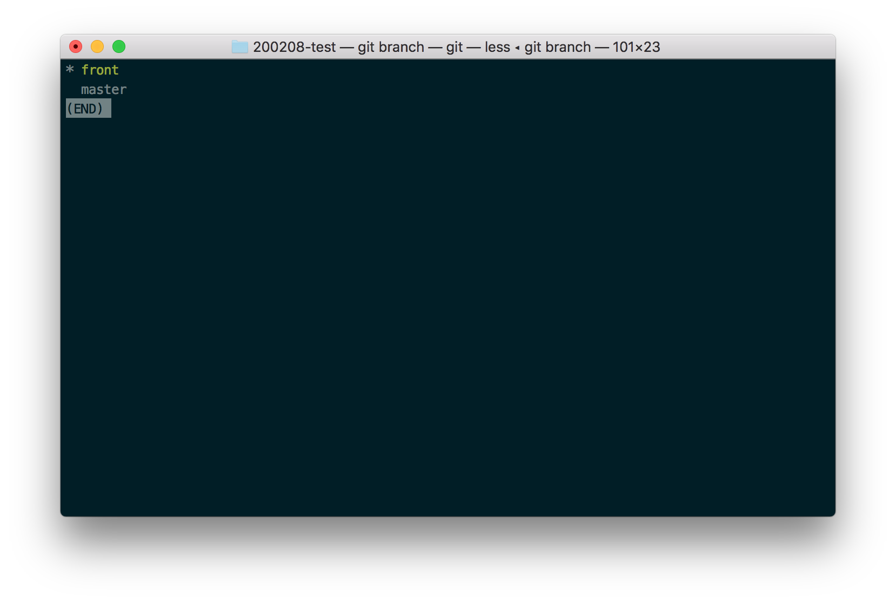

## TL; DR : 세 줄 요약

```bash
# 대상이 될 브랜치 확인하기
$ git branch | grep 'front/leo/'
# 대상이 될 브랜치 명만 확인하여 지우기
$ git branch | grep 'front/leo' | xargs git branch -d
```

## 브랜칭을 하다보면 생기는 일들

git으로 협업할 때, 작업을 하다보면 여러 개의 브랜치가 생기게 됩니다. feature별로 다른 브랜치를 새로 만들어 작업을 하고, 원격 저장소에 업로드 하고, 머지를 하고 나면 해당 브랜치는 필요 없게 됩니다.

github, gitlab 등에서는 브랜치를 합친 후 자동으로 브랜치를 삭제해주는 기능을 제공합니다.


하지만 원격 저장소에서 지웠다고 해서 로컬 저장소에서 지워지는 것은 아닙니다. 따라서 로컬에서도 해당 브랜치를 지우려면 매번 지워줘야 합니다. 

만약 지워야 되는 브랜치의 갯수가 많다면, grep과 xargs를 이용하여 많은 브랜치를 한 번에 지울 수 있습니다.

- `grep` : 리눅스에서 문자열 패턴 검색하는 명령어
- `xargs` : 앞선 명령어의 결과를 파이프(`|`)로 입력받아 다음 명령어의 인자로 넘겨주는 명령어.

### 지워야 하는 브랜치 한 번에 확인하기

 

여기 여섯 개의 브랜치가 있습니다. `git branch | grep 'front-leo-'` 로 패턴에 맞는 `front-leo-` 가 포함된 브랜치를 전부 찾아줍니다.

 

### 지워야 하는 브랜치 한 번에 삭제하기

이제 지워야하는 브랜치를 한 번에 지워주도록 합니다. `git branch | grep 'front-leo-' | xargs git branch -d` 를 입력합니다.

 

지우고 나면 아래와 같이 깔끔해집니다.

 

grep과 xargs는 unix/linux에서 아주 많이 쓰이는 명령어들입니다. 필요에 따라 다양하게 사용할 수 있을 것입니다.

참고 : https://medium.com/@rajsek/deleting-multiple-branches-in-git-e07be9f5073c
