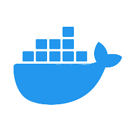
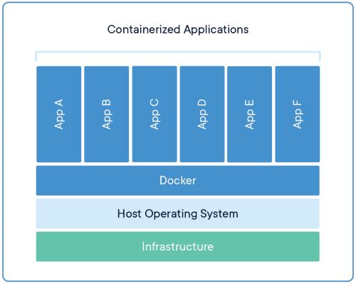
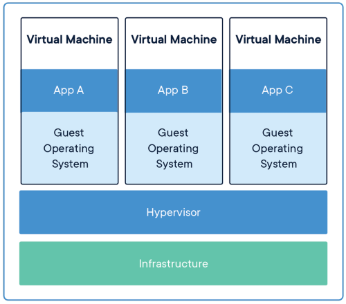

## 도커란 무엇인가?

도커는 리눅스 응용 프로그램을 **컨테이너**라고 불리는 패키지에 배치시키는 PaaS(Platform as a Service)입니다. 컨테이너는 다른 컨테이너로부터 독립되어 있고 자신만의 프로그램, 라이브러리, 설정 파일 등을 묶어 관리합니다. 컨테이너끼리는 잘 설정된 채널을 통해 통신을 할 수 있습니다. 모든 컨테이너는 하나의 OS 커널 위에서 돌아가기 때문에, 가상 머신(Virtual Machine, VM)을 사용하는 것보다 자원을 아낄 수 있습니다.

 _도커의 공식 이미지. 디자인 컨테스트에서 우승한 이미지가 공식 로고가 되었습니다. [여기](https://99designs.com/logo-design/contests/create-cool-open-source-project-logo-219415/entries) 가보면 고래 대신 기린이 되었을수도 있는 것을 볼 수 있습니다(기린도 귀엽)._

## 컨테이너 vs 가상머신

 _컨테이너 위에서 돌아가는 애플리케이션_

컨테이너는 의존성과 코드를 포함하는 애플리케이션 층을 추상화한 개념입니다. 여러 대의 컨테이너는 한 머신에서 돌아갈 수 있고, OS 커널을 다른 컨테이너와 공유할 수 있습니다. 컨테이너의 실행은 유저 입장에서 독립된 프로세스로 돌아갑니다. 컨테이너는 가상 머신보다 적은 공간을 차지하며(보통 컨테이너 이미지는 수십MB 크기) 가상 머신과 OS를 적게 사용하면서도 더 많은 애플리케이션을 다룰 수 있습니다.

 _가상 머신 위에서 돌아가는 애플리케이션_

가상 머신은 물리적 하드웨어 서버를 늘리는 것을 추상화한 개념입니다. 하이퍼바이저(Hypervisor)는 여러 대의 가상 머신이 한 머신에서 돌아갈 수 있게 합니다. 각각의 가상 머신은 한 가지 OS의 전체 사본과 애플리케이션, 필요한 바이너리, 라이브러리를 전부 가지고 있어 수십 GB의 용량을 차지합니다. 가상 머신은 부팅 속도가 느릴 수 있습니다.

참고

[https://en.wikipedia.org/wiki/Docker_(software)](https://en.wikipedia.org/wiki/Docker_(software))
[https://www.docker.com/resources/what-container](https://www.docker.com/resources/what-container)