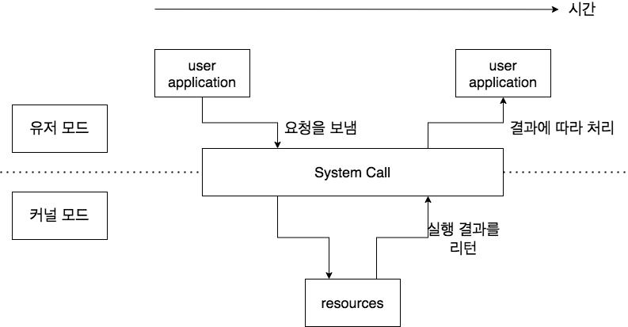

## 유저 모드 / 커널 모드

운영체제에서 유저 모드와 커널 모드의 존재는 자원에 대한 접근 권한과 관련 있습니다. 커널이 하드웨어와 유저 애플리케이션의 중간자 역할을 하기 때문에, 유저 애플리케이션은 하드웨어에 대한 접근을 직접 하기보다 커널에게 대신 해달라고 요청을 보내게 됩니다.

**유저 모드**

- 사용자가 접근할 수 있는 영역의 제한.
- 유저 애플리케이션이 자원에 함부로 접근하지 못하도록 합니다. 보통의 **애플리케이션 코드는 유저 모드에서 실행**된다고 생각하면 됩니다.

**커널 모드**

- HW(CPU, 메모리 등) 및 권한이 필요한 영역(파일 시스템, 네트워크 등)에 접근 가능한 모드.

### 시스템 콜 System Call

- 프로세스는 실행되는 도중 유저모드와 커널모드를 왔다갔다 합니다. 유저 모드에서 실행되는 프로세스가 특별한 요청이 필요할 때 시스템 콜을 통해 커널 모드로 진입하게 되며, 커널 모드에서 실행된 작업이 완료되면 리턴을 통해 유저 모드로 돌아갑니다.

### 시스템 콜에서의 인자 전달

종종 그 과정에서 단순히 시스템 콜을 하는 것보다 더 많은 정보가 필요할 때가 있습니다.(e.g. 수많은 텍스트 데이터를 전달하는 등) 하지만, 유저 모드의 프로세스와 커널 모드에서 시스템 콜을 할때의 메모리는 **서로 다른 프로세스**이기 때문에, 커널은 보통의 방법으로 직접 접근이 불가능합니다.

그렇다면 유저 애플리케이션은 커널에게 인자를 어떻게 전달해야 될까요?

1. 가장 단순한 방법 : CPU에서 레지스터로 직접 전달하는 방법. 인자를 레지스터에 넣은 후 전달합니다.

    단, 제한점은 레지스터의 갯수와 크기가 제한적이라는 것.

2. 인자를 메모리상의 블록이나 테이블에 저장 후, 그 주소를 레지스터를 통해 전달합니다.

    리눅스와 Solaris가 이 방법을 사용.

3. 프로그램의 스택 영역에 인자를 push한 다음, 이를 OS가 pop하여 사용합니다.

참고 : [https://youtu.be/UxCiuctkKYo?t=1201](https://youtu.be/UxCiuctkKYo?t=1201)