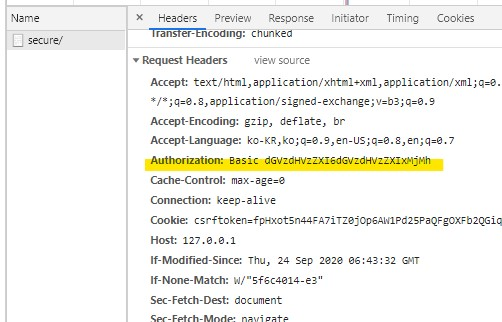
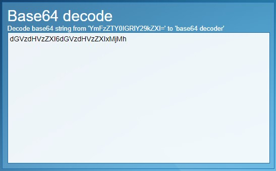
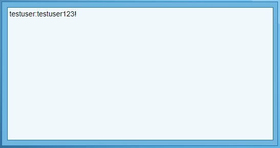
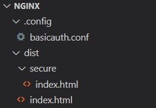
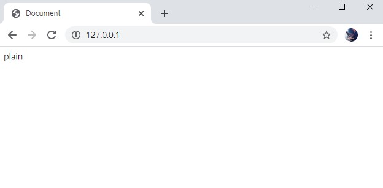
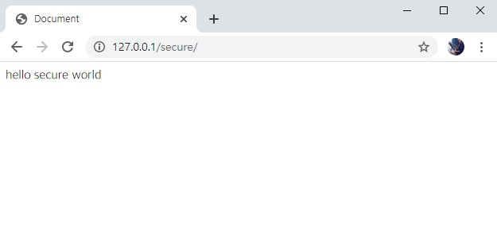
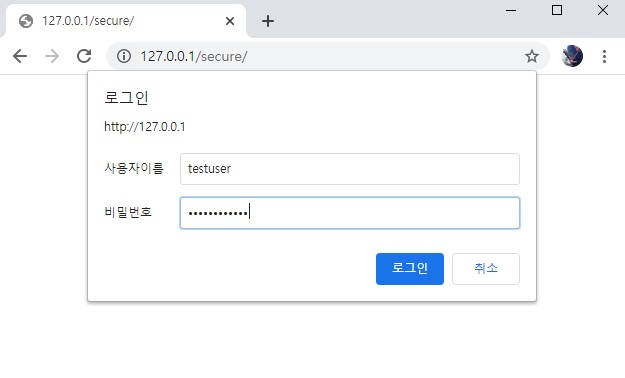
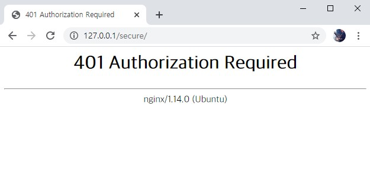

## HTTP basic authentication

NGINX는 사용자 인증을 할 수 있습니다. NGINX를 사용하여 클라이언트의 요청을 인증한다면 불필요한 작업을 줄이면서 애플리케이션에 잘못된 접근을 하는 것을 막을 수 있게 됩니다.

---

## 상황

웹 애플리케이션 또는 페이지에 대한 사용자 인증 처리를 하고 싶은데, 웹 프레임워크를 붙이기에는 귀찮을 때.

### ⚠ 주의할 점 1

<ins>**HTTPS와 함께 사용해야 합니다.**</ins> 만약 http 평문으로 전송되었을 경우, 요청 헤더에 `Authorization` 내용이 담기게 됩니다. 이는 **양방향 해싱인 base64로 인코딩**되어 있기 때문에 아래 그림과 같이 복호화가 가능합니다.

 *Authorization 헤더*

 *인코딩 된 상태*

 *디코딩 된 상태* ( _출처 : https://www.base64decode.net/_ )

### ⚠ 주의할 점 2

`htpasswd` 등이 관리하는 웹 암호파일이 웹서버의 URI 공간에 있으면 *안됩니다*. 즉, 브라우저가 이 파일을 볼 수 없어야 합니다. 만약 `index.html`과 같은 공간에 있다면 요청을 보내는 브라우저는 `example.com/.htpasswd` 등과 같이 비밀번호 파일을 가져갈 수 있게 됩니다.

이 파일의 내용은 암호화되어있기는 하지만, 해싱 알고리즘, salt, 결과가 전부 적혀있기 때문에 주의해서 저장해야 합니다.

---

## 적용 방법

1. htpasswd, openssl 등의 방법을 사용하여 암호화된 비밀번호가 담긴 파일을 작성합니다.

    비밀번호 파일의 형태는 아래와 같습니다. 이 때 비밀번호는 **해싱이 된 결과값**이어야 합니다.

    ```
    username1:password1
    username2:password2:comment
    ```

2. 요청을 막을 주소를 nginx conf에 적용합니다.

### 상세 절차

0. **예시에 사용한 프로젝트 디렉토리 구조**

    

1. **htpasswd**

    - install apache2-utils

      ```bash
      $ sudo apt-get update
      $ sudo apt-get install apache2-utils
      ```

    - make password

      ```bash
      $ sudo htpasswd -c /etc/apache2/.htpasswd testuser
      [sudo] password for ubuntu:
      New password:
      Re-type new password:
      Adding password for user testuser
      ```

    - check .htpasswd file

      ```bash
      $ cat /etc/apache2/.htpasswd
      testuser:$apr1$O.C....
      ```

    - 보안상 주의할 점 ( 다시 강조 ! )

      > `htpasswd` 등이 관리하는 웹 암호파일이 웹서버의 URI 공간에 있으면 *안된다*. 즉, 브라우저가 이 파일을 볼 수 없어야 한다.
      > 만약 index.html과 같은 공간에 있다면 example.com/.htpasswd 등과 같이 사용자 정보 및 암호가 담긴 파일을 가져갈 수 있기 때문이다.

2. **demo project structure(있으면 생략 가능)**

    - project structure

      ```
      dist/
      +-- index.html
      \-- secure/
      \-- secure_index.html
      ```

    - index.html : 아무나 접근 가능한 index 파일

    - secure/secure_index.html : 인증을 거친 사용자만 접근 가능한 index 파일

3. **nginx**

    - install nginx

      ```bash
      $ sudo apt-get update
      $ sudo apt-get install nginx
      ```

    - nginx conf 내용 채우기

      - 특정 path로 들어오는 요청을 block

        ```bash
        location /secure/path/ {
          auth_basic				"Private Site";			# Any String
          auth_basic_user_file	/etc/apache2/.htpasswd; # path of passwd file
        }
        ```

      - 특정 path로 들어오는 요청만 허용

        ```bash
        location /allow/path/ {
          auth_basic				off;
        }
        ```

4. **실행**

    - 설정파일 및 소스 복사

      ```bash
      # copy configuration file
      sudo cp -f ./.config/basicauth.conf /etc/nginx/sites-available/
      
      # make symbolic link
      sudo ln -sf /etc/nginx/sites-available/basicauth.conf /etc/nginx/sites-enabled/basicauth.conf
      
      # copy dist file
      cp -rf ./dist /var/www/html/
      ```

    - 실행

      ```bash
      sudo service nginx start # 또는 sudo servicectl start nginx
      ```


### 실행 결과

- 허용한 주소 접속시

  

- block한 주소 접속시

  

- 로그인 안내

  

- 비밀번호 에러

  
